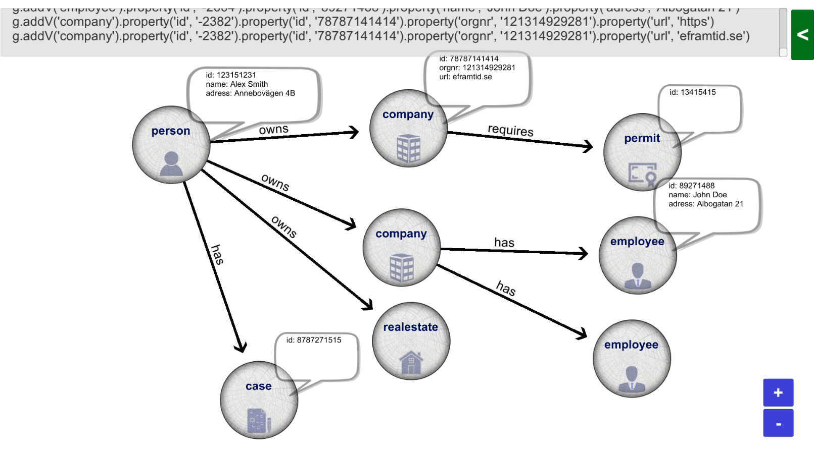

cosmosdb-graph-builder
======

This product is developed in Unity 3D engine.
It is supposed to be used to create relationships between objects fast using relevant keywords.
The product will help with documentation as well as make it easier to be consistent with relations, keywords etc.

## Features
* **Build graphs** fast and easy
	* Pre-existing node and edge types
* **Import graphs** from Azure Cosmos DB
* **Upload graphs** to Azure Cosmos DB
* **Export graphs** to Gremlin (query language) code

## Getting started
### Run application
If you would like to run the application as an exe, download it from the following link:
https://drive.google.com/file/d/1ZzmRF--9dbcwYM2Rlku_aBjYEkbSiequ/view?usp=sharing

However, if you would like to run it directly on the browser, navigate to the following link:
https://www.eframtid.se/kna/arrow/

Be aware, the browser version of this application is only for demo, it is not stable nor performant. 
The browser version also lacks some functionality.

### Get the project up and running on your local machine for development and testing purposes.

#### Requirements
* Unity >= 2019.4.10

### How to use the software
#### Camera movement:
	WASD or Up, left-, down- & right-arrows
	Move faster by holding left-shift

#### Pan camera:
	Press and hold left ALT while dragging

#### Zoom in and out:
	Click plus or minus to zoom in/out
	Also works with comma and period
	Also works with scrolling or pinching

#### Zoom and snap to object:
	Press F when mouse on object

##### Hide graphical user interface
	You can hide all GUI by pressing H. (this function is locked when user is in menus)

#### Hide dialog bubbles
	You can hide all dialog bubbles by pressing B. (this function is locked when user is in menus)

#### Add node:
	Double click on empty space on screen

#### Delete node:
	You can delete the node in edit mode or by
	left-clicking and holding a node while pressing the delete button

#### Change node types:
	You can "scroll" through node types by middle clicking on a node

#### Delete edge:
	You can delete the edge in edit mode or by
	left-clicking and holding an edge while pressing the delete button

#### Reverse edge:
	You can reverse the edge in edit mode or by
	left-clicking and holding an edge while pressing R on the keyboard

#### Change edge types:
	You can "scroll" through edge types by middle-clicking on an edge

#### Create relationship between 2 nodes:
	left-click and hold from the edge of a node to another node
	Also works with rightclick (on the node, not the edge) and hold before "drawing"

#### Create node and relationship from one node to new node:
	Left-click on nodes edge and hold, draw to empty space
	Also works with rightclick and hold before "drawing" to empty space

#### Edit node: 
    Here you can:
      Double-click on node
      Edit label (type)
      Edit properties
      Edit node color
      Delete node

#### Move node (and all of its relations):
	Left-click and hold node, move mouse to move node

#### Edit line by double clicking on it
	Here you can:
		Reverse line
		Delete line
		Edit label
		Edit properties
		See the "to" and "from" node connections 

#### You can set default node and edge proeprties for specific types in edit mode
    You can save and load scenes (json-format)
    You can export to Gremlin
    You can load graphs from cosmos db (json) and also convert them to Gremlin code
    You can upload data to cosmos database with one click! (note: it does not drop any existing data, if not explicitly doing so)

## Contributors
#### [Mostafa Hassan](https://github.com/MostafaHassan)
cosmosdb-graph-builder is an open-source project administered by **e-framtid**. We appreciate your interest and efforts to contribute.

## License
This project is licensed under the MIT License - see the LICENSE.md file for details
